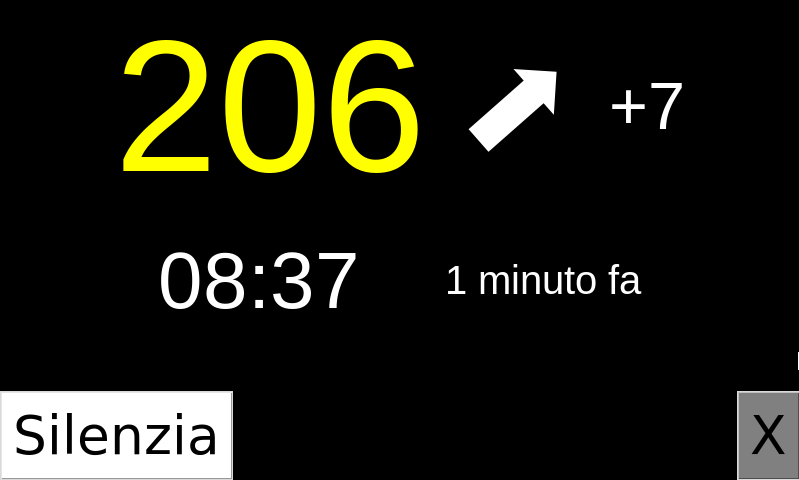
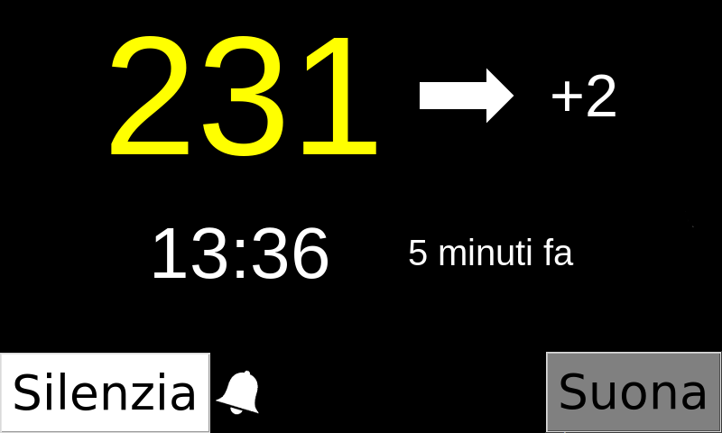
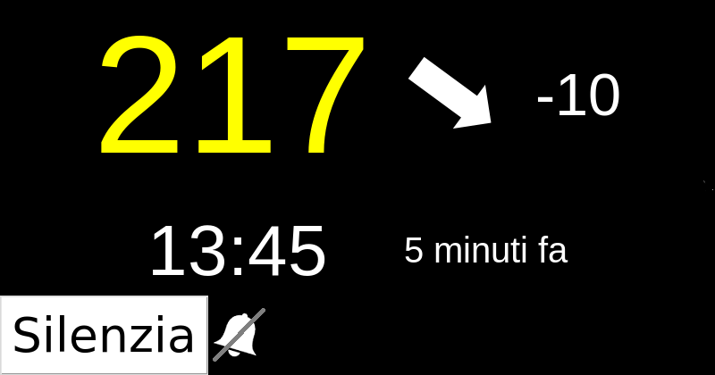
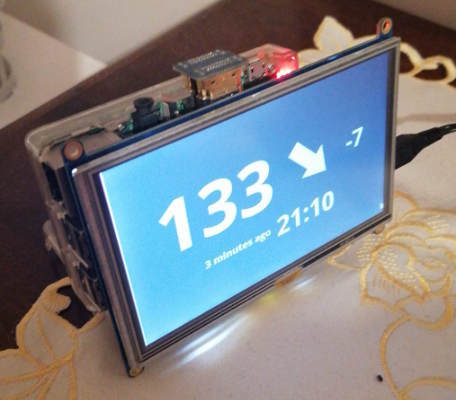

# nightscout-python-monitor
Un monitor in python che si basa su nightscout e GUIZero. 
Hardware necessario un raspberry pi (almeno il 4) e un monitor gpio/hdmi da 5 pollici con touchscreen (questo è quello del prototipo: http://www.waveshare.com/wiki/5inch_HDMI_LCD )

Software necessario Raspberry Pi OS.

Applicazioni necessarie:

sudo apt-get install python3 python3-pip git python3-tk python3-dateutil
sudo pip3 install guizero

Nel file monitor.py bisogna mettere HOST-NIGHTSCOUT e TOKEN relativi al proprio nightscout nelle prime righe nonchè il nome del proprio utente e la cartella (rigorosamente nella cartella root del proprio utente) dove risiede il programma.

L'impaginazione è adeguata per un monitor con risoluzione 800x480.

Il tasto silenzia, se attivo, fa suonare gli allarmi ogni 30 minuti. Sennò suona ogni 5 finchè i valori non tornano in range.

PS: per adesso gli allarmi NON suonano perchè sto cercando una soluzione smart per "dare voce" al raspberry (mini speaker penso).

Foto1: nuova versione in fase di sviluppo

Foto2: monitor con allarme

Foto3: monitor con allarme silenziato

Foto3: prototipo reale (con vecchia versione)

