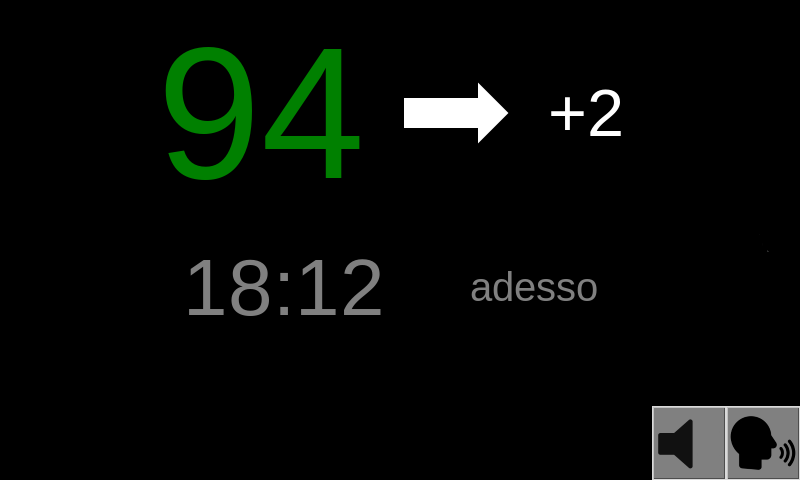
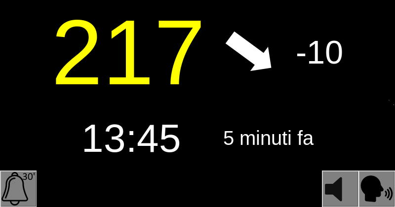
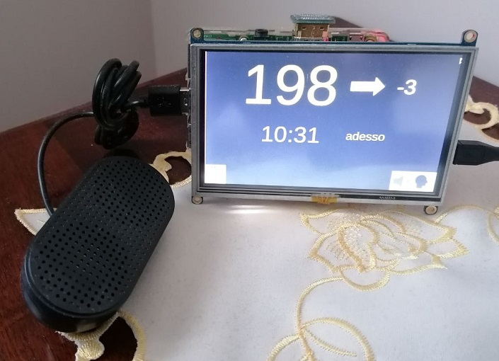

<h2>NOTA: le foto del prototipo sono della versione vecchia!</h2>

# nightscout-python-monitor
Un monitor che mostra la glicemia da nightscout in python che si basa GUIZero. 
Hardware necessario un raspberry pi (almeno il 4) e un monitor gpio/hdmi da 5 pollici con touchscreen (questo è quello del prototipo: http://www.waveshare.com/wiki/5inch_HDMI_LCD )
L'impaginazione quindi è adeguata per un monitor con risoluzione 800x480.

<b>Applicazioni necessarie:</b>

Sistema operativo necessario Raspberry Pi OS.

sudo apt-get install python3 python3-pip git python3-tk python3-dateutil

sudo pip3 install guizero

sudo pip3 install gtts

<b>Dettagli:</b>

- Nel file monitor.py bisogna mettere HOST-NIGHTSCOUT e TOKEN relativi al proprio nightscout nelle prime righe nonchè il nome del proprio utente e la cartella (rigorosamente nella cartella root del proprio utente) dove risiede il programma.

- Il tasto con la campanella e la dicitura 5' è attivo appena compare un allarme e fa suonare gli allarmi ogni 5 minuti. Se invece viene premuto suona ogni 30 finchè i valori non tornano in range (e il disegno cambia diventando una campanella con la dicitura 30')

- La visualizzazione del tasto per uscire è impostabile dai parametri globali. Di default è disattivata.

- Se i valori sono più vecchi di 15 minuti (impostabile nei parametri) le scritte diventano tutti trattini e di colore grigio. Si ripristina da solo al primo valore disponibile più recente.

- In basso a destra c'è il tasto Muto/Suona per, rispettivamente, spegnere completamente gli allarmi o farglieli gestire in autonomia.

- Lettura vocale dei valori di glucosio con tasto di mute dedicato alla sola voce  <b>---> IN FASE DI SVILUPPO <---</b>

<b>Speaker:</b>

Piccolo inciso sullo speaker (ho preso questo: https://it.aliexpress.com/item/1005004442879029.html?spm=a2g0o.order_list.order_list_main.10.5eda36968OiFYM&gatewayAdapt=glo2ita ).
Per farlo andare senza troppi sbattimenti sul raspberry aprite il file /etc/modprobe.d/raspi-blacklist.conf e ci mettete dentro "blacklist snd_bcm2835" (senza virgolette) e poi aprite il file /lib/modprobe.d/aliases.conf e commentate con un # davanti la riga con scritto "options snd-usb-audio index=-2" (anche qui senza virgolette) e poi riavviate il rapsberry. Praticamente così facendo escludete tutti gli audio integrati e lasciate attivo e predefinito solo lo speaker usb.

Foto1: monitor in funzione con valori in range

Foto2: monitor con allarme (allarme ogni 5 minuti)

Foto3: monitor con snooze attivato (allarme ogni 30 minuti)

Foto4: monitor con valori oltre il tempo massimo impostato e allarmi impostati su muto

Foto5: prototipo reale (fronte)

Foto6: prototipo reale (retro)

